# pMF 训练链补齐与技术分析

该目录展示了一条围绕 `MeanFlow -> pMF -> Muon -> Residual Attention` 的训练链补齐与实验分析主线。核心目标不是展示单张“最好看的图”，而是把原本以推理为主的 PyTorch 仓库整理成一个可训练、可比较、可分析的研究型实验框架。

当前最可信的结论是：

- 训练逻辑已统一收束到 [meanflow.py](./meanflow.py)，补齐了 `MNIST + U-Net + MeanFlow` baseline，以及 `CIFAR10 + Transformer + pMF`、`Muon`、`Residual Attention` 三条主比较路径。
- `CIFAR10` 上三组主线都能稳定跑到 `5000 step` 并产出可视化样本，足以观察早期结构趋势，但还不足以下最终性能结论。
- `MNIST` 上的负结果很有研究价值：`Transformer + pMF` 明显不如 baseline，而 `pMF + U-Net` 出现了“中期像、后期糊”的现象。

更完整的研究叙事、实验归因和面试版讲稿见 [interview_project_showcase.md](./interview_project_showcase.md)。

## 项目概述

这个仓库当前承载了两部分内容：

- 上游 `pMF` PyTorch 推理代码
- 当前补齐的训练链、实验产物与研究分析

本轮改造的重点是把训练逻辑统一集中到 [meanflow.py](./meanflow.py)，让它负责：

- 数据集选择
- backbone 选择
- 训练目标选择
- 优化器选择
- sample 保存
- checkpoint 保存
- metrics 记录

最终形成的工程演进链是：

```text
MNIST + U-Net + MeanFlow
-> CIFAR10 + Transformer + MeanFlow
-> CIFAR10 + Transformer + pMF
-> CIFAR10 + Transformer + pMF + Muon
-> CIFAR10 + Transformer + pMF + Muon + Residual Attention
```

对应的关键提交如下：

| Commit | 说明 |
| --- | --- |
| `57aca02` | 模块化 `MNIST + U-Net + MeanFlow` baseline |
| `2ab65b7` | 迁移到 `CIFAR10 + Transformer + MeanFlow` |
| `58a4759` | 增加 `pMF` 训练目标 |
| `99ec9a9` | 增加 `Muon` 优化器分组 |
| `cf446da` | 增加当前版本的 `Residual Attention` |

## 实验目标

这条实验链的目标不是直接冲论文级指标，而是先回答 3 个更基础也更重要的问题：

1. 能否在当前 PyTorch 仓库里补齐一条统一训练入口，而不是分散成多套脚本。
2. 能否在同一个 `Transformer` 骨架上比较 `pMF / pMF + Muon / pMF + Muon + Residual Attention`。
3. 能否通过 `MNIST` 的正反结果帮助判断方法边界，而不是只展示“成功案例”。

## 主结果：CIFAR10

### 实验设置

主比较固定为：

- `dataset = cifar10`
- `backbone = transformer`
- `variant = pmf`
- `seed = 1024`
- `batch_size = 256`
- `max_steps = 5000`
- `patch_size = 4`
- `hidden_size = 256`
- `depth = 8`
- `num_heads = 4`
- `mlp_ratio = 4.0`

只改变两类变量：

- 优化器：`adamw` 或 `muon`
- attention 实现：`naive` 或 `residual`

### Loss 曲线对比

下图直接由三组 `CIFAR10` 主实验的 `metrics.json` 生成，用于补充 sample 图之外的训练过程证据：

- 左图：`train_loss` 的 EMA 平滑曲线，使用对数纵轴
- 右图：每 `250 step` 记录一次的 `val_loss` 原始点，黑边圆点标出各自 run 的最低验证损失位置

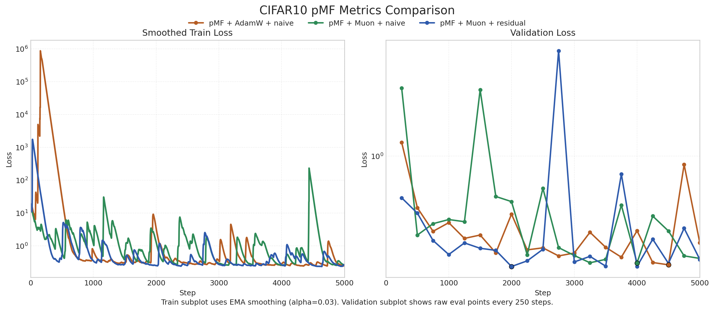

从这张图可以读出几件事情：

- `pMF + AdamW + naive` 的训练过程波动更大，中途出现了更明显的尖峰。
- `pMF + Muon + naive` 的训练尾段更平滑，但当前 run 的 `best_val_loss` 并不优于另外两组。
- `pMF + Muon + residual` 更早进入较低验证损失区间，并取得当前三组中最低的 `best_val_loss`。

该图可通过下面的命令从现有 run 自动重建：

```bash
python scripts/plot_cifar_metrics.py
```

### Step 2000：早期结构趋势

| `pMF + AdamW + naive` | `pMF + Muon + naive` | `pMF + Muon + residual` |
| --- | --- | --- |
| 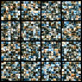 | 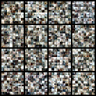 | 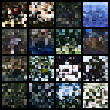 |

从当前固定 seed 的样本看，`Muon + residual` 在 `step 2000` 已经出现更明显的区域结构和颜色组织，而 `AdamW + naive` 仍然更像分散的噪声块。

### Step 5000：当前阶段性结果

| `pMF + AdamW + naive` | `pMF + Muon + naive` | `pMF + Muon + residual` |
| --- | --- | --- |
| 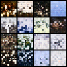 | 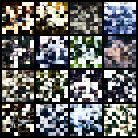 | 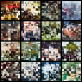 |

`5000 step` 足以比较“谁更早出现结构”和“谁更稳定”，但还不足以比较最终生成质量。因此这里的定位是早期趋势展示，而不是最终结论。

### 当前可引用的数值结果

这些数字直接来自各自 run 目录下的 `metrics.json`：

| 实验 | `best_val_loss` | 说明 |
| --- | ---: | --- |
| `pMF + AdamW + naive` | `0.2431` | 当前 run 中波动较大，但最终也回到较低区间 |
| `pMF + Muon + naive` | `0.2492` | 视觉上更稳，尾段 loss 更平滑 |
| `pMF + Muon + residual` | `0.2378` | 当前三组里最低的 `best_val_loss`，且更早出现结构 |

更稳妥的表述是：

- 这是 `5000 step` 的阶段性结果，不是最终性能结论。
- 当前 run 下，`Muon + residual` 的 `best_val_loss` 最低。
- 当前样本显示 `Muon + residual` 更早学到结构，但还需要更长训练和更多 seed 才能下稳定结论。

## 研究观察：MNIST 的负结果

`MNIST` 不是这份展示的主结果区，但它是形成研究判断的重要来源。

### 观察 1：baseline 很早成形，`Transformer + pMF` 明显不如 baseline

| `MeanFlow baseline + U-Net` | `pMF + Transformer` |
| --- | --- |
| 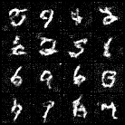 | 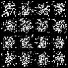 |

这个对比说明，在 `MNIST` 这种低维、局部结构极强的问题上，卷积归纳偏置非常强。单纯把 backbone 换成 transformer、把目标换成 pMF，并不会自动带来更好的生成。

### 观察 2：`pMF + U-Net` 出现“中期像、后期糊”

| `pMF + U-Net @ step 500` | `pMF + U-Net @ step 5000` |
| --- | --- |
| 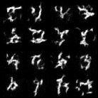 | 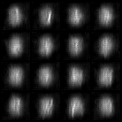 |

这个现象说明：

- 训练 loss 继续下降，不代表采样视觉质量会单调变好。
- 在当前没有 EMA 的实现里，中间 checkpoint 可能比最后 checkpoint 更适合展示。
- 负结果本身就是研究信号，它帮助界定方法更可能适合哪里、不适合哪里。

## 项目 Pipeline

```text
dataset
  -> corruption / time sampling
  -> backbone (U-Net or Transformer)
  -> objective (MeanFlow or pMF)
  -> optimizer (Adam / AdamW / Muon+AdamW)
  -> train loop
  -> sample grid / checkpoint / metrics
```

如果具体到当前 `pMF + Transformer` 主线，可以再拆成：

```text
CIFAR10 image x
  -> sample r, t and noise epsilon
  -> build z_t
  -> model predicts x_pred
  -> analytic transform to u
  -> JVP to estimate d u / d t
  -> build V
  -> optimize v-loss
```

## 代码结构

```text
pMF/
├── meanflow.py
├── optim/
│   └── muon.py
├── scripts/
│   └── plot_cifar_metrics.py
├── evaluate.py
├── models/
├── assets/
│   ├── teaser.png
│   └── showcase/
└── runs/
```

各部分职责如下：

- [meanflow.py](./meanflow.py)：训练主中心，统一 dataset、backbone、variant、optimizer、采样与保存逻辑。
- [optim/muon.py](./optim/muon.py)：单机版 `Muon + Aux AdamW` 实现，负责矩阵参数走 Muon、其余参数走 AdamW。
- [scripts/plot_cifar_metrics.py](./scripts/plot_cifar_metrics.py)：从三个 CIFAR10 `metrics.json` 自动生成 README 中的对比图表。
- [evaluate.py](./evaluate.py)：保留上游推理与评估职责，不参与这条 CIFAR10 训练主线。
- `assets/showcase/`：当前 README 使用的稳定展示图片。
- `runs/`：完整实验产物，包括 config、sample、checkpoint 和 metrics。

## 模型训练

### 1. MNIST baseline

```bash
python meanflow.py \
  --dataset mnist \
  --backbone unet \
  --variant meanflow \
  --optimizer adamw \
  --workdir ./runs/mnist_meanflow_baseline_adamw \
  --batch-size 256 \
  --max-steps 5000
```

### 2. CIFAR10 pMF + AdamW + naive

```bash
python meanflow.py \
  --dataset cifar10 \
  --backbone transformer \
  --variant pmf \
  --optimizer adamw \
  --attn-impl naive \
  --workdir ./runs/cifar10_pmf_adamw_transformer_naive \
  --batch-size 256 \
  --max-steps 5000
```

### 3. CIFAR10 pMF + Muon + naive

```bash
python meanflow.py \
  --dataset cifar10 \
  --backbone transformer \
  --variant pmf \
  --optimizer muon \
  --attn-impl naive \
  --workdir ./runs/cifar10_pmf_muon_transformer_naive \
  --batch-size 256 \
  --max-steps 5000
```

### 4. CIFAR10 pMF + Muon + residual

```bash
python meanflow.py \
  --dataset cifar10 \
  --backbone transformer \
  --variant pmf \
  --optimizer muon \
  --attn-impl residual \
  --workdir ./runs/cifar10_pmf_muon_transformer_residual \
  --batch-size 256 \
  --max-steps 5000
```

## 当前技术判断

基于当前代码和结果，更合理的定位是：这是一条研究型复现链，而不是“已经完整复现论文”的项目。当前最可信的判断是：

- `pMF` 的价值更可能出现在更高维、更复杂的 pixel-space 问题上，而不是低维简单数据。
- backbone、目标函数、优化器和 attention 机制必须拆开比较，否则很难归因。
- 在生成任务里，`last checkpoint` 不一定是最适合展示的 checkpoint。


## 论文与许可证

- 论文：[*One-step Latent-free Image Generation with Pixel Mean Flows*](https://arxiv.org/abs/2601.22158)
- 许可证：当前目录沿用上游仓库的 `MIT` 许可证，见 [LICENSE](./LICENSE)

## 上游背景

<details>
<summary>展开查看上游仓库背景</summary>

这个目录最初来源于 `pMF` 官方 PyTorch 推理仓库，原始 README 重点是 ImageNet 预训练权重和推理评估。当前首页已改写为训练链与研究展示页，但上游推理相关代码仍保留在：

- [evaluate.py](./evaluate.py)
- [models/pmfDiT.py](./models/pmfDiT.py)
- `evaluate.py` 对应的采样与 FID 评估路径

若只关注当前新增和分析的内容，建议优先阅读：

- [meanflow.py](./meanflow.py)
- [optim/muon.py](./optim/muon.py)
- [interview_project_showcase.md](./interview_project_showcase.md)

</details>
