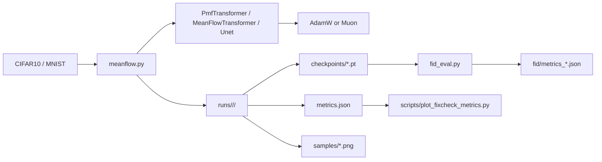
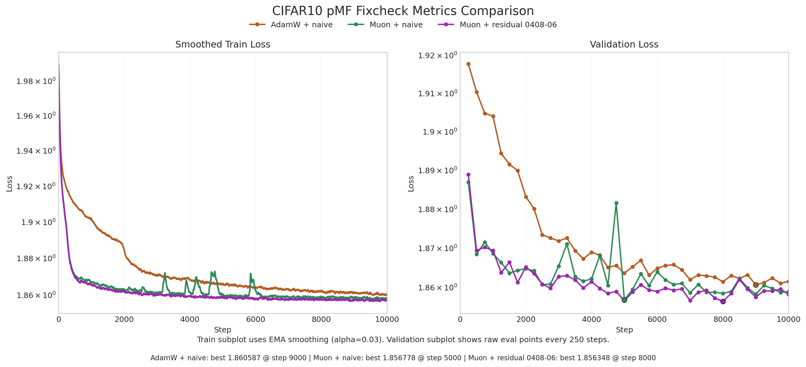
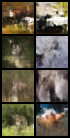
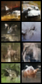
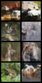

# Pixel MeanFlow x Muon x Residual Attention


## 项目概述

这个项目的核心目标，是在 `pMF` 的基础上，验证 `Muon` 优化器和 Kimi 风格 residual attention 是否能带来实际的训练和生成质量提升。

1. 先在 `meanflow.py` 上打通 **数据加载 -> 训练 -> 采样 -> checkpoint -> FID** 的完整流程。
2. 在 `pMF` 的 transformer 主干上接入 **Muon**，验证它相对 `AdamW` 的优化收益。
3. 在此基础上实现 **Kimi / Moonshot AI 风格的 residual attention 思路**，把原来的固定残差加法改成深度方向的注意力聚合，并与 baseline 做公平对照。


## 项目目的

原始 `pMF` 更偏向论文方法本身，而这个项目关注的是实验平台化与结构扩展：

- 能否把 `pMF` 整理成一个清晰、可恢复训练、可导出结果的训练入口？
- `Muon` 在 `pMF + transformer` 上，是否比 `AdamW` 收敛更快或最终更好？
- 引入 Kimi 风格 residual attention 之后，优化收益会体现在训练损失、验证损失，还是最终生成质量上？


## 技术亮点

- 基于 `meanflow.py` 打通 **训练 / 采样 / checkpoint / FID** 全流程
- 在 `PmfTransformer` 上接入 **Muon + AdamW 辅助参数组** 的混合优化器
- 实现 **Kimi 风格 residual attention** 的深度维历史聚合
- 保留 `AdamW + naive`、`Muon + naive`、`Muon + residual` 三条路径，便于公平对照
- 输出可直接复用的 `metrics.json`、`samples/`、`checkpoints/`、`fid/*.json`
- 提供批量实验脚本和结果绘图脚本，适合继续扩展更多 ablation

## 项目架构

### 训练与评估流程



### 目录结构

```text
.
├── meanflow.py                         # 训练主入口：模型、loss、采样、checkpoint、CLI
├── fid_eval.py                         # 针对 run_dir 的 FID 评估入口
├── evaluate.py                         # 独立 pMF 推理 / 评估入口
├── pmf.py                              # 独立推理封装
├── run.md                              # 常用实验命令
├── codestr.md                          # 代码结构拆解文档
├── requirements.txt                    # 依赖
├── models/
│   ├── pmfDiT.py                       # 原始 pMF DiT 推理主干
│   ├── embedder.py                     # 条件嵌入与 patch embed
│   └── torch_models.py                 # RMSNorm / SwiGLU / Linear 等基础层
├── optim/
│   └── muon.py                         # Muon + AdamW 混合优化器
├── scripts/
│   ├── run_cifar10_suite.sh            # 批量跑 CIFAR10 实验
│   ├── plot_cifar_metrics.py           # 旧版对照图绘制
│   └── plot_fixcheck_metrics.py        # fixcheck 对照图绘制
├── assets/showcase/                    # README 中使用的结果图
└── runs/                               # 实验输出目录
```

## `meanflow.py` 的核心改动

这个项目最重要的工作，是把 `meanflow.py` 从“单文件原型”整理成一个可以长期做实验的入口，并在其中加入 Muon 和 residual attention。

关键改动包括：

1. **统一训练实验主线**
   把数据集构建、模型构建、loss、采样、checkpoint、恢复训练、指标持久化都收拢到 `meanflow.py`。

2. **新增 `FullAttentionResidual`**
   用可学习伪查询向量对 embedding 和历史层输出做深度维 softmax 聚合，形成当前 residual input。

3. **在 `TransformerBlock` 中加入双聚合器**
   在 `attn` 前和 `mlp` 前各执行一次 residual aggregation，对应：
   - `pre_attn_residual`
   - `pre_mlp_residual`

4. **在 `PmfTransformer` / `MeanFlowTransformer` 末尾加入 output aggregation**
   residual 模式下，最终输出不是直接取“最后一层 token”，而是对整条 depth history 再做一次汇聚。

5. **接入 `Muon`**
   在 `build_optimizer()` 中把 shared / head transformer 主矩阵参数分配到 Muon，其余参数保留 AdamW 风格更新，形成混合优化器。

6. **补齐评估与实验脚本**
   通过 `fid_eval.py`、`scripts/run_cifar10_suite.sh`、`scripts/plot_fixcheck_metrics.py` 把训练结果组织成完整实验资产。

## 我的工作

我在这个项目中完成了以下工作：

- 基于 `pMF` 搭建完整的训练、采样、恢复训练与评估流程
- 在 `PmfTransformer` 上实现 `attn_impl=naive / residual` 两条路径
- 引入 `FullAttentionResidual`，实现 Kimi 风格 residual attention 的深度聚合版本
- 实现 `Muon + AdamW` 混合优化器，并将其接到 `pMF + transformer` 实验链
- 组织 `AdamW + naive`、`Muon + naive`、`Muon + residual` 三组 CIFAR10 对照实验
- 补齐 FID 评估、曲线绘制、run 目录管理与实验结果沉淀

## Quick Start

### 1. 安装依赖

```bash
pip install -r requirements.txt
pip install torchvision numpy tqdm matplotlib
```

### 2. 运行 smoke test

`meanflow.py` 会自动下载 `MNIST` 或 `CIFAR10`，所以不需要单独 prepare 数据。

```bash
python meanflow.py \
  --workdir ./runs/smoke_pmf_cifar10 \
  --dataset cifar10 \
  --backbone transformer \
  --variant pmf \
  --optimizer adamw \
  --attn-impl naive \
  --max-steps 20 \
  --batch-size 8 \
  --grad-accum-steps 2 \
  --eval-every 20 \
  --sample-every 20 \
  --save-every 20 \
  --sample-batch-size 4 \
  --num-workers 0
```

### 3. 运行 `AdamW + naive`

```bash
python meanflow.py \
  --workdir ./runs/cifar10_pmf_adamw_transformer_naive_fixcheck \
  --dataset cifar10 \
  --backbone transformer \
  --variant pmf \
  --optimizer adamw \
  --attn-impl naive \
  --max-steps 10000 \
  --batch-size 128 \
  --grad-accum-steps 4 \
  --eval-every 250 \
  --sample-every 200 \
  --save-every 500 \
  --sample-batch-size 8 \
  --num-workers 4
```

### 4. 运行 `Muon + naive`

```bash
python meanflow.py \
  --workdir ./runs/cifar10_pmf_muon_transformer_naive_fixcheck \
  --dataset cifar10 \
  --backbone transformer \
  --variant pmf \
  --optimizer muon \
  --attn-impl naive \
  --max-steps 10000 \
  --batch-size 128 \
  --grad-accum-steps 4 \
  --eval-every 250 \
  --sample-every 200 \
  --save-every 500 \
  --sample-batch-size 8 \
  --num-workers 4
```

### 5. 运行 `Muon + residual`

```bash
python meanflow.py \
  --workdir ./runs/cifar10_pmf_muon_transformer_residual_fixcheck \
  --dataset cifar10 \
  --backbone transformer \
  --variant pmf \
  --optimizer muon \
  --attn-impl residual \
  --max-steps 10000 \
  --batch-size 128 \
  --grad-accum-steps 4 \
  --eval-every 250 \
  --sample-every 200 \
  --save-every 500 \
  --sample-batch-size 8 \
  --num-workers 4
```

### 6. 计算 FID

```bash
python fid_eval.py \
  --run-dir ./runs/cifar10_pmf_muon_transformer_residual_fixcheck/<timestamp> \
  --checkpoint last \
  --data-root ./data \
  --num-samples 50000 \
  --gen-bsz 128 \
  --fid-batch-size 128 \
  --device cuda
```

结果会写到：

- `fid/metrics_last_50000.json`

### 7. 绘制对照图

```bash
python scripts/plot_fixcheck_metrics.py
```

生成：

- `assets/showcase/fixcheck_metrics_comparison.png`

### 8. 恢复训练

```bash
python meanflow.py \
  --workdir ./runs/cifar10_pmf_muon_transformer_residual_fixcheck \
  --dataset cifar10 \
  --backbone transformer \
  --variant pmf \
  --optimizer muon \
  --attn-impl residual \
  --max-steps 15000 \
  --batch-size 128 \
  --grad-accum-steps 4 \
  --eval-every 250 \
  --sample-every 200 \
  --save-every 500 \
  --sample-batch-size 8 \
  --num-workers 4 \
  --resume ./runs/cifar10_pmf_muon_transformer_residual_fixcheck/<timestamp>/checkpoints/last.pt
```

## 实验设置

当前 README 展示的主结果，来自 `fixcheck` 三组 CIFAR10 对照实验：

| 项目 | 配置 |
| --- | --- |
| 数据集 | `cifar10` |
| 模型 | `pMF + transformer` |
| 图像尺寸 | `32 x 32` |
| patch size | `4` |
| hidden size | `256` |
| depth | `8` |
| num heads | `4` |
| batch size | `128` |
| grad accumulation | `4` |
| 训练步数 | `10000` |
| eval every | `250` |
| sample every | `200` |
| save every | `500` |
| 对照组 1 | `AdamW + naive` |
| 对照组 2 | `Muon + naive` |
| 对照组 3 | `Muon + residual` |

## 10000 Step 对照结果

当前仓库已经保留三组完整实验目录：

- `runs/cifar10_pmf_adamw_transformer_naive_fixcheck/20260407-072247`
- `runs/cifar10_pmf_muon_transformer_naive_fixcheck/20260407-072247`
- `runs/cifar10_pmf_muon_transformer_residual_fixcheck/20260408-065603`

### 1. 训练与验证曲线



从这组三组对照里，可以先得到两个直接结论：

- `Muon` 相比 `AdamW`，无论是验证损失还是 FID 都有明显提升。
- `Muon + residual` 在最佳验证损失上略优于 `Muon + naive`，但当前 `last checkpoint` 的 FID 还没有超过 `Muon + naive`。

### 2. 定性样本对比

#### AdamW + naive @ 5000 step



#### Muon + naive @ 5000 step



#### Muon + residual @ 5000 step



这里直接使用 `runs` 目录中的 5k step 原始 sample 图，便于和对应 checkpoint、`metrics.json`、FID 结果一一对照。定性图主要用于辅助观察样本清晰度、结构稳定性和颜色分布，结论仍应以损失曲线和 FID 为主。

### 3. 关键数值摘要

| 指标 | AdamW + naive | Muon + naive | Muon + residual | 结论 |
| --- | --- | --- | --- | --- |
| `best val loss` | `1.860587` | `1.856778` | `1.856348` | residual 最优 |
| `best val step` | `9000` | `5000` | `8000` | Muon 更早达到较优区域 |
| `FID @ last, 50000 samples` | `57.0194` | `37.5238` | `38.7136` | Muon 明显优于 AdamW |

如果只看关键差值：

- `Muon + naive` 相比 `AdamW + naive`，`best val loss` 降低约 `0.00381`，FID 改善约 `19.50`
- `Muon + residual` 相比 `Muon + naive`，`best val loss` 再降低约 `0.00043`
- 但当前 `Muon + residual` 的 FID 比 `Muon + naive` 高约 `1.19`

### 4. 结果解读

这组结果更适合被解读成三个层面的发现：

1. **Muon 的收益是明确的**
   在当前 `pMF + transformer + CIFAR10` 设置下，`Muon` 不只是让 loss 更低，而且对最终 FID 的改善非常明显。

2. **Residual attention 更像“优化层面的微增益”**
   当前实现的 Kimi 风格 residual attention，确实让 `best val loss` 继续下降，但这个优势还没有稳定转化成更低的 FID。

3. **生成质量与优化指标并不总是同步**
   这正是这类架构实验值得做对照的原因。更低的验证损失，不一定立即对应更好的样本质量；因此 README 里同时保留了 `metrics.json` 和 `fid/*.json` 两类结果。
4. **从loss下降稳定性来看**
   `Muon + residual` 的曲线明显比 `Muon + naive` 更平滑，说明 residual attention 的聚合机制确实在训练过程中提供了更稳定的梯度流。

## 后续研究方向

### 1. 更长训练区间

当前主结果集中在 `10000` step，还不足以判断：

- residual attention 的小幅 loss 优势是否会持续扩大
- `Muon + residual` 是否会在更长训练后反超 `Muon + naive` 的 FID
- 三条曲线是否会在更后期出现重新排序

### 2. residual attention 设计消融

当前实现采用的是 full-history residual aggregation，后续可以继续比较：

- pre-attention 聚合和 pre-MLP 聚合各自的贡献
- 是否需要 final output aggregation
- 使用 `RMSNorm` 与不用 `RMSNorm` 的差异
- full-history 与 blockwise BAR 的差异

### 3. Muon 超参数消融

后续可以系统测试：

- `muon_lr`
- `muon_momentum`
- `muon_ns_steps`
- `muon_weight_decay`

从而区分“Muon 本身有效”与“当前超参碰巧适合”的问题。

### 4. 更强评估

除了 FID，还可以补充：

- `best checkpoint` 的 FID
- IS / precision-recall / KID
- 更多 fixed seed 的定性样本对比
- 更大模型规模或更难数据集上的迁移验证

## 常用输出目录

一次训练通常会在 `runs/<experiment>/<timestamp>/` 下生成：

- `config.json`
- `metrics.json`
- `samples/`
- `checkpoints/`
- `fid/`（运行 FID 后）

你最常需要看的文件通常是：

- `metrics.json`
- `checkpoints/best.pt`
- `checkpoints/last.pt`
- `samples/step_*.png`
- `fid/metrics_last_50000.json`

## 参考资料

- [实验命令整理](run.md)
- [代码结构拆解](codestr.md)
- [fixcheck 对照图](assets/showcase/fixcheck_metrics_comparison.png)
- [AdamW + naive 5k sample](runs/cifar10_pmf_adamw_transformer_naive_fixcheck/20260407-072247/samples/step_0005000.png)
- [Muon + naive 5k sample](runs/cifar10_pmf_muon_transformer_naive_fixcheck/20260407-072247/samples/step_0005000.png)
- [Muon + residual 5k sample](runs/cifar10_pmf_muon_transformer_residual_fixcheck/20260408-065603/samples/step_0005000.png)
- Attention Residuals / BAR 论文：`arXiv:2603.15031`

---

如果你关注的是 **生成模型训练工程化、Muon 优化器实验、Transformer residual path 改造**，或者想找一个适合继续做 ablation 的小型研究框架，这个项目可以作为一个很好的起点。
